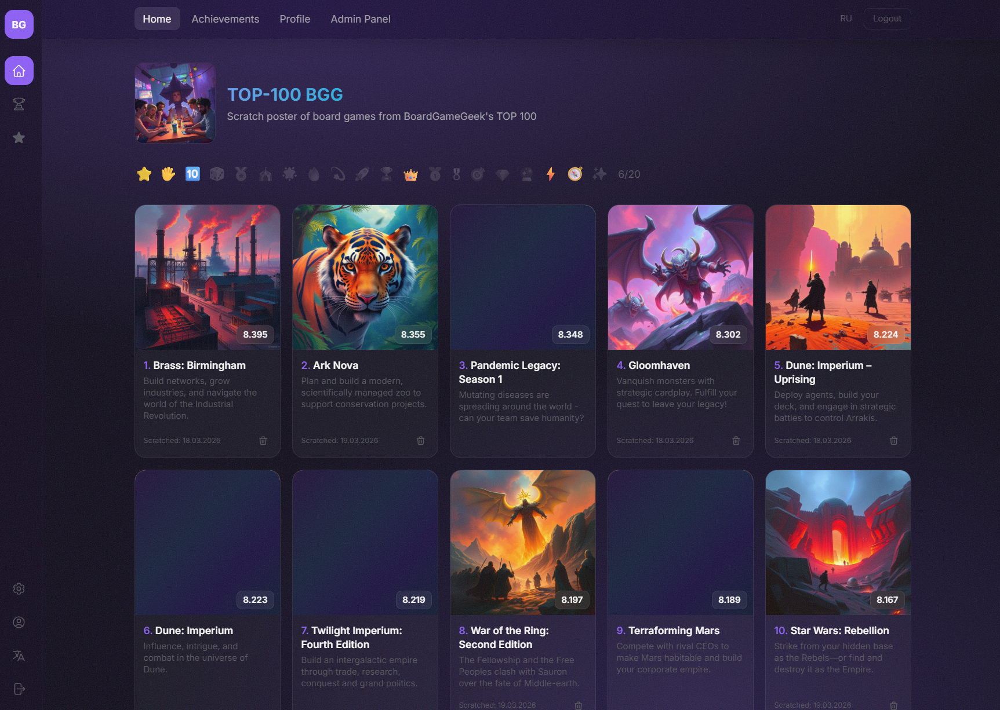
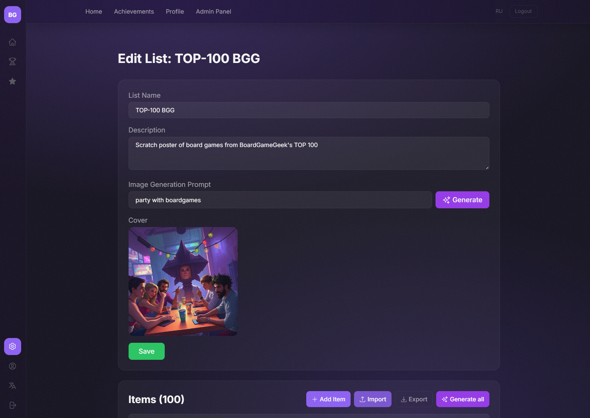
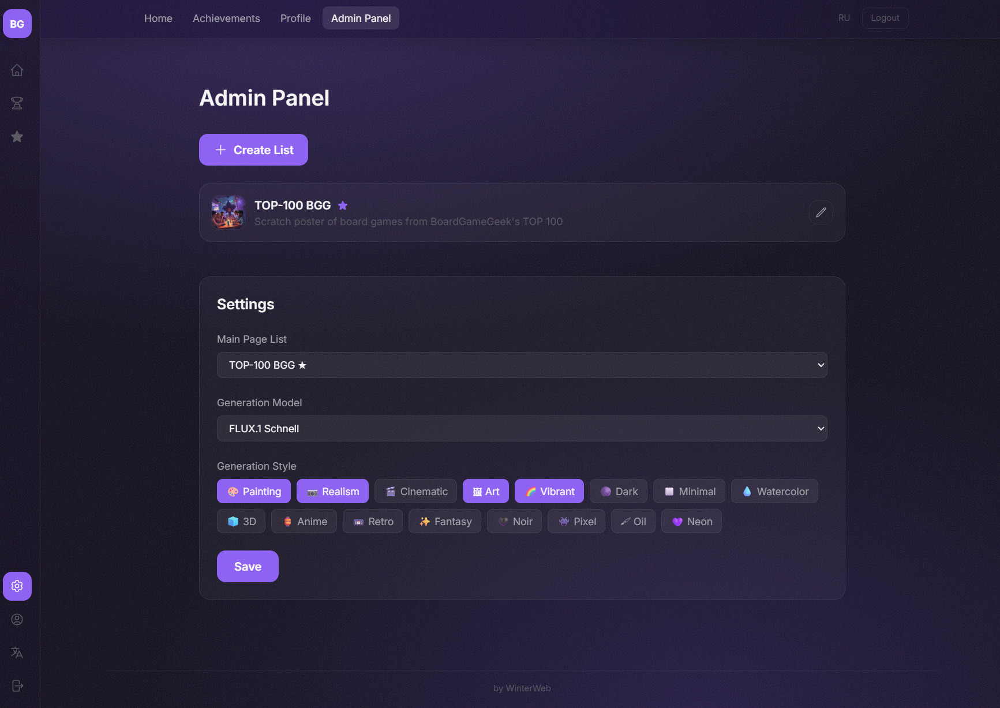
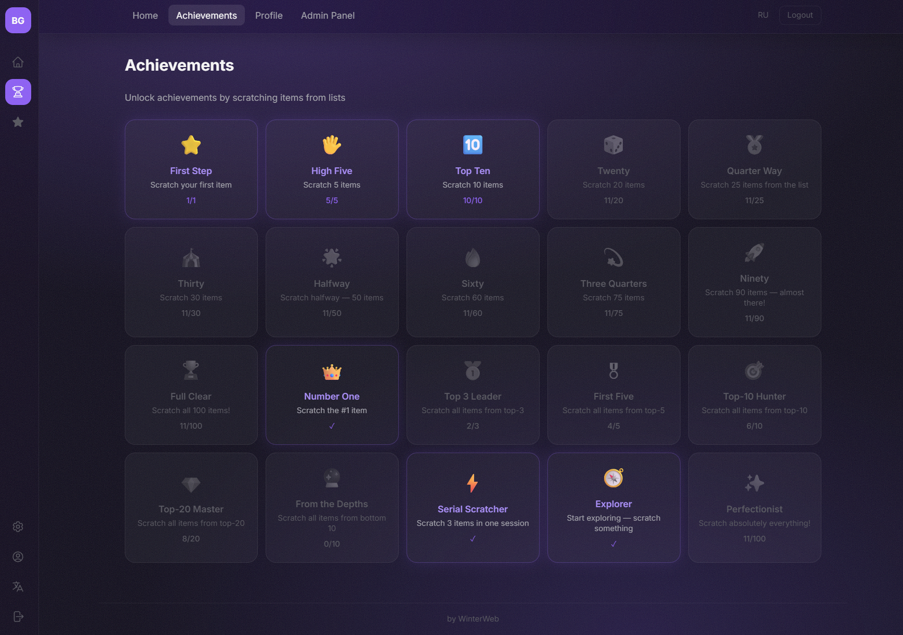
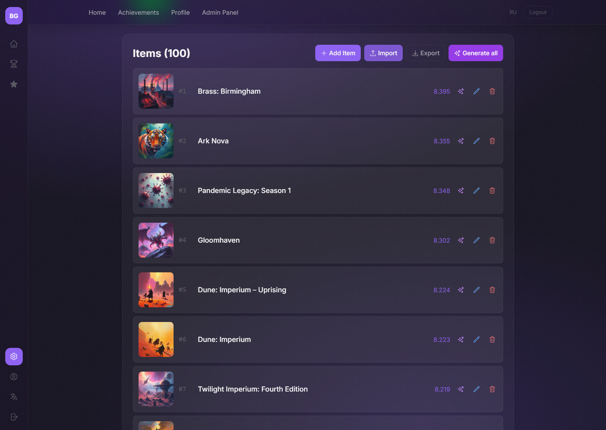

**[English](README.md) | [Русский](README.ru.md)**

# My Scratch List

### [myscratchlist.vercel.app](https://myscratchlist.vercel.app)

**Скретч-постеры нового поколения.** Создавай топ-листы чего угодно, генерируй обложки нейросетью, стирай элементы как лотерейные билеты и делись результатами с друзьями.



---

## Что это такое?

Помнишь скретч-карты? Те самые, где монеткой стираешь серебристый слой и узнаёшь, что выиграл. Мы взяли эту механику и превратили её в веб-приложение.

Админ создаёт топ-лист (фильмы, игры, книги, альбомы, рестораны — что угодно), а пользователи "стирают" элементы, которые они уже попробовали/посмотрели/прошли. Прогресс сохраняется, достижения открываются, друзья завидуют.

---

## Фичи

### Бесконечные топ-листы

Создавай сколько угодно списков на любую тему. ТОП-100 настольных игр, ТОП-50 фильмов 2025, ТОП-30 ресторанов города — любые подборки. Каждый список появляется в сайдбаре как отдельная страница. Выбирай какой список показывать на главной.

### AI-генерация обложек

Каждому элементу и каждому списку можно сгенерировать уникальную обложку через **Together AI**. Пишешь промпт или просто жмёшь кнопку — нейросеть рисует.

- **Точечная генерация** — сгенерировать картинку для одного элемента прямо из списка
- **Массовая генерация** — кнопка "Сгенерить все" обрабатывает весь список батчами по 3
- **Превью перед сохранением** — не нравится результат? Перегенерируй сколько угодно раз
- **Выбор модели** — от быстрого FLUX.1 Schnell до топовых моделей, список подгружается с Together AI



### Стили генерации

16 стилевых чипов, которые можно комбинировать как хочешь:

🎨 Рисунок · 📷 Реализм · 🎬 Кинематографичный · 🖼 Арт · 🌈 Яркий · 🌑 Тёмный · ◻️ Минимализм · 💧 Акварель · 🧊 3D · 🏮 Аниме · 📼 Ретро · ✨ Фэнтези · 🖤 Нуар · 👾 Пиксель · 🖌 Масло · 💜 Неон

Выбранные стили применяются ко всем генерациям. Хочешь весь список в стиле "кинематографичный + тёмный"? Два клика.



### Скретч-механика

Наводишь мышку на карточку — под фиолетовым покрытием прячется картинка. Стираешь пальцем или мышкой — как настоящую скретч-карту. Когда стёрто достаточно — элемент засчитывается и сохраняется в профиле.

### 20 достижений

Система ачивок с прогрессом и описаниями при наведении:

⭐ Первый шаг · 🖐 Пятёрка · 🔟 Десятка · 🎲 Двадцатка · 🏅 Четверть · 🎪 Тридцатка · 🌟 Экватор · 🔥 Шестьдесят · 💫 Три четверти · 🚀 Девяносто · 🏆 Полная зачистка · 👑 Номер один · 🥇 Тройка лидеров · 🎖 Первая пятёрка · 🎯 Топ-10 · 💎 Топ-20 · 🔮 Из глубин · ⚡ Серийный стиратель · 🧭 Исследователь · ✨ Перфекционист

Разблокированные светятся фиолетовым. Заблокированные — серые. Отдельная страница со всеми достижениями и подробными описаниями.



### Регистрация через сид-фразу

Никаких паролей и email. При регистрации генерируется уникальная фраза из 12 слов (стандарт BIP39). Записал — входишь откуда угодно. Потерял — пока. Просто и безопасно.

Никнейм генерируется автоматически (SwiftWolf42, BraveDragon777...) и гарантированно уникальный.

### Персональный профиль и шеринг

У каждого пользователя своя страница с прогрессом. Скопируй ссылку и отправь друзьям — они увидят какие элементы ты стёр и какие достижения открыл. На странице профиля можно переключаться между списками, если их несколько.

### Админ-панель

Всё управление в одном месте:

- Создание и удаление списков
- Inline-редактирование каждого элемента (название, ранг, рейтинг, описание, картинка)
- Импорт и экспорт элементов в JSON
- Генерация обложек — точечная, массовая, с превью
- Выбор нейросети и стилей генерации
- Выбор списка для главной страницы



### Мультиязычность

Русский и английский интерфейс. Переключается одной кнопкой в сайдбаре. Все тексты, достижения, стили генерации — всё переведено.

### Дизайн

Тёмная тема с grainy gradient фоном и liquid glass эффектами. Фиолетовые акценты, noise-текстура, backdrop-blur на навигации и сайдбаре. Адаптивная вёрстка — работает на десктопе и мобильных.

---

## Быстрый старт

```bash
git clone <repo-url>
cd Boardgamer-Fan-Site
npm install
cp .env.example .env.local
# Заполни .env.local своими данными
npm run dev
```

Открывай `http://localhost:3000` и вперёд.

---

## ENV-переменные

| Переменная         | Описание                                    |
| ------------------ | ------------------------------------------- |
| `MONGODB_URI`      | Строка подключения к MongoDB                |
| `MONGODB_DB`       | Имя базы данных                             |
| `SECRET`           | Секрет для NextAuth JWT                     |
| `TOGETHER_API_KEY` | API ключ [Together AI](https://together.ai) |

---

## Деплой

Проект готов к деплою на **Vercel**. Добавь ENV-переменные в настройках проекта и задеплой.

---

_by [WinterWeb](https://winterweb.ru)_
